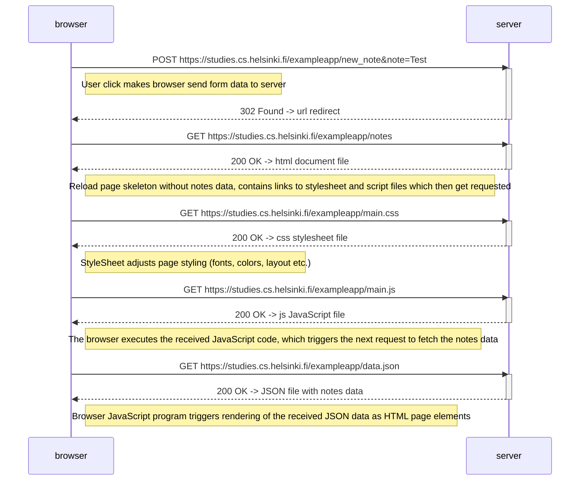

```mermaid
sequenceDiagram
    participant browser
    participant server

    browser->>server: POST https://studies.cs.helsinki.fi/exampleapp/new_note&note=Test
    activate server
    Note right of browser: User click makes browser send form data to server
    server-->>browser: 302 Found -> url redirect
    deactivate server

    browser->>server: GET https://studies.cs.helsinki.fi/exampleapp/notes
    activate server
    server -->>browser: 200 OK -> html document file
    deactivate server

    Note right of browser: Reload page skeleton without notes data, contains links to stylesheet and script files which then get requested

    browser->>server: GET https://studies.cs.helsinki.fi/exampleapp/main.css
    activate server
    server-->>browser: 200 OK -> css stylesheet file
    deactivate server

    Note right of browser: StyleSheet adjusts page styling (fonts, colors, layout etc.)

    browser->>server: GET https://studies.cs.helsinki.fi/exampleapp/main.js
    activate server
    server -->>browser: 200 OK -> js JavaScript file
    deactivate server

    Note right of browser: The browser executes the received JavaScript code, which triggers the next request to fetch the notes data

    browser->>server: GET https://studies.cs.helsinki.fi/exampleapp/data.json
    activate server
    server-->>browser: 200 OK -> JSON file with notes data
    deactivate server

    Note right of browser: Browser JavaScript program triggers rendering of the received JSON data as HTML page elements
```
