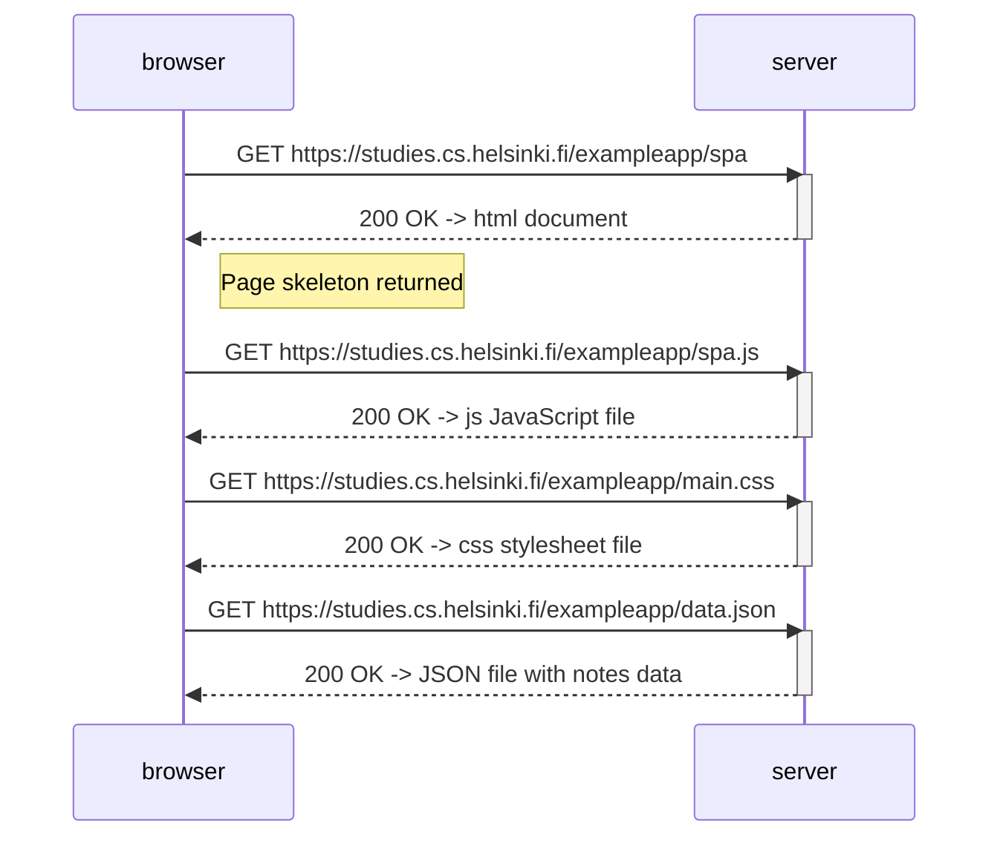

```mermaid
sequenceDiagram
    participant browser
    participant server

    browser->>server: GET https://studies.cs.helsinki.fi/exampleapp/spa
    activate server
    server-->>browser: 200 OK -> html document
    deactivate server

    Note right of browser: Page skeleton returned

    browser->>server: GET https://studies.cs.helsinki.fi/exampleapp/spa.js
    activate server
    server -->>browser: 200 OK -> js JavaScript file
    deactivate server

    browser->>server: GET https://studies.cs.helsinki.fi/exampleapp/main.css
    activate server
    server-->>browser: 200 OK -> css stylesheet file
    deactivate server

    browser->>server: GET https://studies.cs.helsinki.fi/exampleapp/data.json
    activate server
    server -->>browser: 200 OK -> JSON file with notes data
    deactivate server
```
