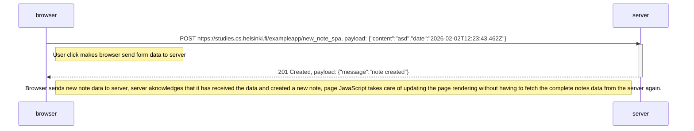

```mermaid
sequenceDiagram
    participant browser
    participant server

    browser->>server: POST https://studies.cs.helsinki.fi/exampleapp/new_note_spa, payload: {"content":"asd","date":"2026-02-02T12:23:43.462Z"}
    activate server
    Note right of browser: User click makes browser send form data to server
    server-->>browser: 201 Created, payload: {"message":"note created"}
    deactivate server

    Note right of browser: Browser sends new note data to server, server aknowledges that it has received the data and created a new note, page JavaScript takes care of updating the page rendering without having to fetch the complete notes data from the server again.
```
